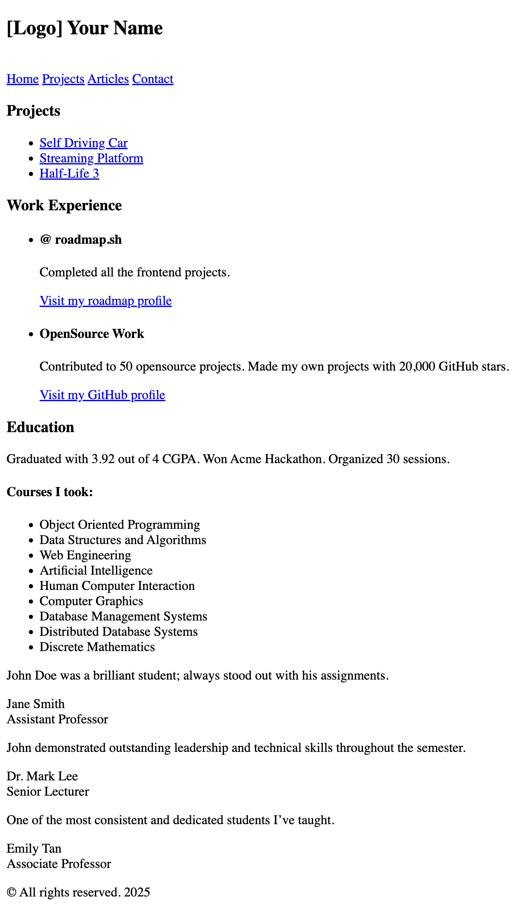

# Basic HTML Website

## The Project
https://roadmap.sh/projects/basic-html-website

This is a basic HTML website built with semantic HTML5. It showcases users' projects, work experience, education, and reviews from their professors. The project is part of my ongoing progress through the frontend development path on [roadmap.sh](https://www.roadmap.sh).

### Screenshot
